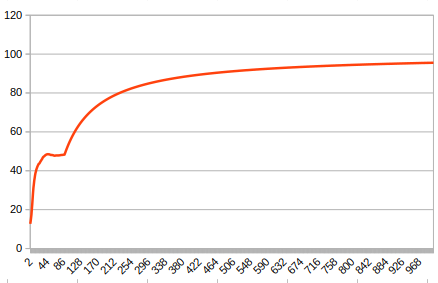

# Pandas

## V1

First pull on the master branch, a basic FNN work. Really nothing fancy just reads the image all layer are basic (no convolution or w/e).

If you want more info and want to understand my code, i tried to put as much explanation in comments as possible.

### Data

I built this exact program using the -O3 parameters. I then ran it over 1000000 trainings. It took 22m40s. Here is a graph of Success rate (in percent) over trials (in 1000)

